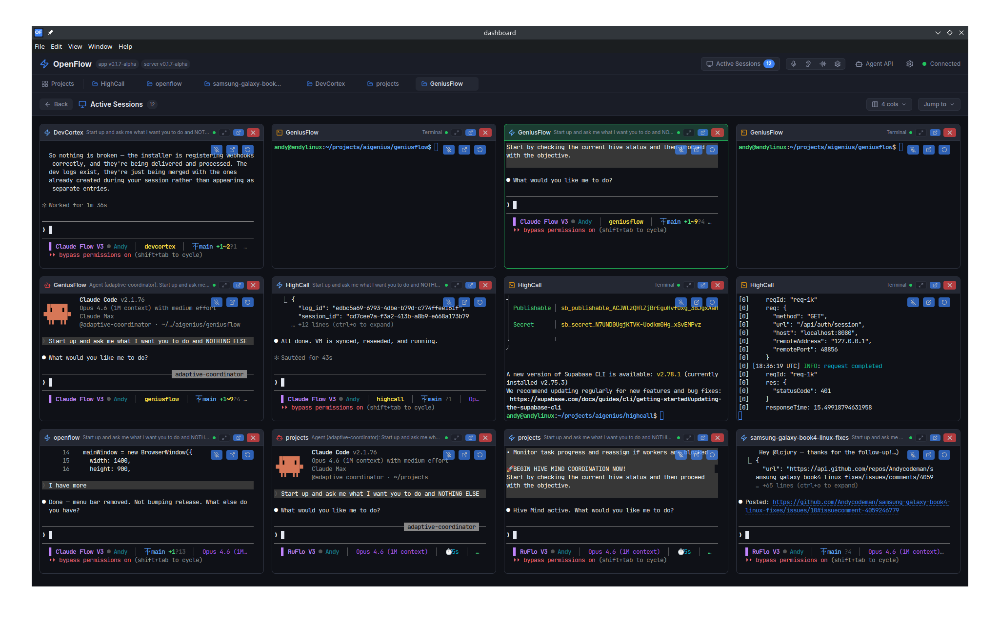
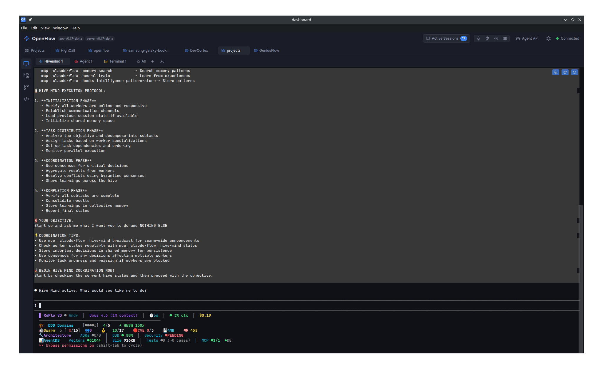
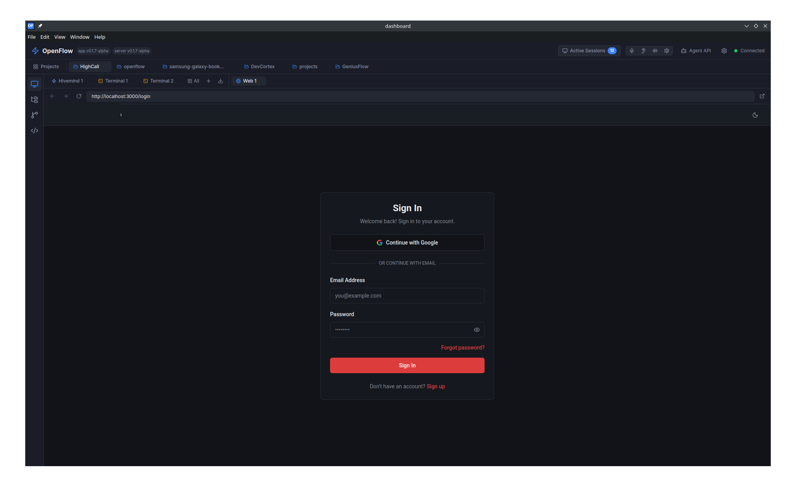
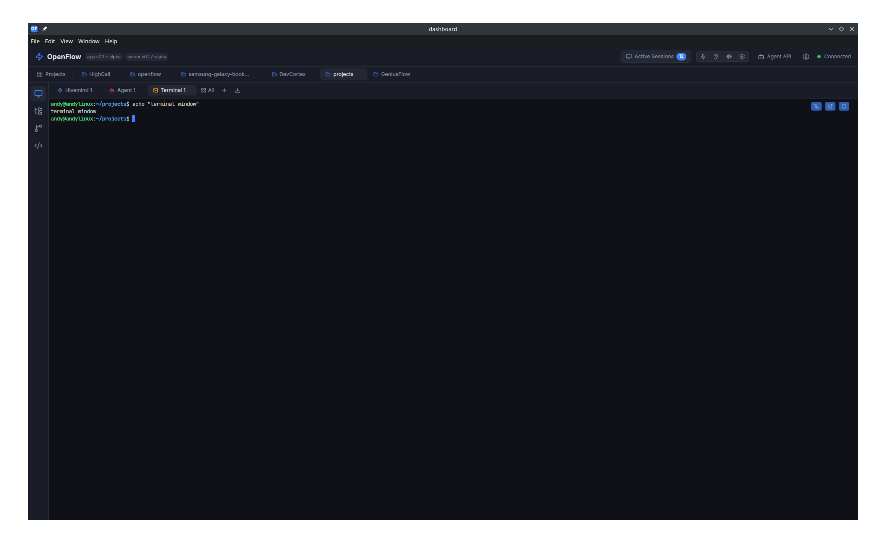

<p align="center">
  
  <p align="center">
    <strong>AI Coding Session Orchestration Dashboard</strong>
  </p>
  <p align="center">
    The dashboard for Claude Code. Launch, monitor, and manage AI coding sessions<br>
    with <a href="https://github.com/ruvnet/ruflo">RuFlo</a> multi-agent orchestration — all from one place.
  </p>
</p>

<p align="center">
  <a href="https://github.com/ai-genius-automations/octoally/stargazers"></a>
  <a href="https://github.com/ai-genius-automations/octoally/blob/main/LICENSE"></a>
  <a href="https://github.com/ai-genius-automations/octoally/releases"></a>
  <a href="https://aigeniusautomations.com"></a>
</p>

---

> **OctoAlly** is a local-first orchestration dashboard for [Claude Code](https://docs.anthropic.com/en/docs/claude-code) and [RuFlo](https://github.com/ruvnet/ruflo). Run multi-agent hive-mind sessions, single-agent workflows, and interactive terminals — all from a beautiful web UI with real-time streaming.

---

## Screenshots

<p align="center">

</p>

**Active Sessions Grid** — Monitor all your AI coding sessions at a glance. The grid view shows every running session across all projects — hive-mind agents, solo Claude Code sessions, and terminals — each with live-streaming output. Click any cell to expand, or use the column controls to fit your screen.

<table>
<tr>
<td width="50%">

<p><b>Hive-Mind Session</b> — Multi-agent orchestration powered by RuFlo. A coordinator agent breaks your objective into subtasks, delegates to specialized workers, and uses Byzantine consensus to merge results. Shared memory and HNSW vector search let agents build on each other's work.</p>
</td>
<td width="50%">

<p><b>Built-in Web Browser</b> — Browse web pages directly inside OctoAlly alongside your coding sessions. Full browser with address bar, back/forward, and OAuth support — agents can build a web app and you can test it in the next tab without leaving the dashboard.</p>
</td>
</tr>
<tr>
<td width="50%">

<p><b>Interactive Terminals</b> — Full terminal sessions managed through tmux. Pop out to a system terminal anytime, do your work, then adopt the session back into OctoAlly — it picks up right where you left off. Sessions persist across server restarts.</p>
</td>
<td width="50%">

<p><b>Git Source Control</b> — Built-in git integration with side-by-side diffs, staged/unstaged changes, commit history, and a file explorer. Review what your AI agents changed, stage files, and commit — all without leaving the dashboard.</p>
</td>
</tr>
</table>

**More highlights:**

- **Reconnect anytime** — Close a tab, restart the server, even reboot — every session is backed by tmux and persists. Reconnect and pick up exactly where you left off with full scrollback.
- **Pop out & adopt back** — Open any session in your system terminal (`tmux attach`), work with your favorite tools, then bring it back into the dashboard. No lock-in.
- **Voice dictation** — Speak your instructions using local Whisper STT (no cloud, no data leaves your machine) or cloud APIs like OpenAI/Groq. API keys are encrypted at rest with AES-256-GCM.
- **Per-project agents** — Define custom agent personas in `.claude/agents/*.md` and launch them from the dashboard. Each project gets its own RuFlo config and agent definitions.

---

## Features

- **Active Sessions Grid** — See every running session across all projects in a live-updating grid with real-time streaming output
- **Hive-Mind Sessions** — Launch multi-agent Claude Code orchestration via [RuFlo](https://github.com/ruvnet/ruflo) with shared memory and consensus
- **Agent Sessions** — Run single-agent sessions with custom agent definitions (`.claude/agents/*.md`)
- **Interactive Terminals** — Full terminal sessions with tmux persistence — pop out to system terminal and adopt back anytime
- **Built-in Web Browser** — Browse and test web apps alongside your coding sessions with full OAuth support
- **Git Source Control** — Side-by-side diffs, staged changes, commit history, and file explorer — review and commit AI-generated changes in-app
- **File Explorer** — Browse your project files, open and edit them, all from the sidebar
- **Session Persistence** — Every session survives server restarts, tab closes, and reboots — reconnect with full scrollback
- **Real-Time Streaming** — WebSocket-powered live output, tool calls, and progress tracking
- **Multi-Project Support** — Per-project RuFlo initialization, agent configurations, and task queues
- **Voice Dictation** — Speak your instructions via local Whisper or cloud APIs (OpenAI, Groq) — keys encrypted at rest
- **Desktop App** — Electron system tray app with auto-launch, server management, and native STT

---

## Quick Install

### Supported Platforms

| Platform | Status |
|----------|--------|
| **Linux** (Ubuntu/Debian) | Fully supported |
| **macOS** (Intel & Apple Silicon) | Fully supported |

### Prerequisites

| Requirement | Why | Install |
|-------------|-----|---------|
| **Node.js 20+** | Runtime for the server | [nodejs.org](https://nodejs.org) |
| **Claude Code** | AI coding agent | `npm install -g @anthropic-ai/claude-code` |

> **Important:** Before installing OctoAlly, you must run Claude Code at least once to accept terms and enable non-interactive mode:
> ```bash
> claude                              # Accept terms & sign in
> claude --dangerously-skip-permissions  # Enable non-interactive agent sessions
> ```

### One-Line Install

```bash
curl -fsSL https://raw.githubusercontent.com/ai-genius-automations/octoally/main/scripts/install.sh | bash
```

The installer will:
1. Check for Node.js and Claude Code (offer to install if missing)
2. Verify Claude Code has been initialized
3. Download and extract the pre-built release
4. Install the `octoally` CLI
5. Start the server
6. Optionally install the desktop app

> **Custom install location:** `OCTOALLY_INSTALL_DIR=/opt/octoally bash install.sh`

### What you get

- **Web Dashboard:** http://localhost:42010
- **CLI:** `octoally start | stop | restart | status | update | logs`
- **Desktop App:** Optional Electron app with system tray and speech-to-text

### Manual Install (Development)

```bash
git clone https://github.com/ai-genius-automations/octoally.git
cd octoally

# Server
cd server && npm install && npm run build && cd ..

# Dashboard
cd dashboard && npm install && npm run build && cd ..

# Start
cd server && npm start
```

- **Dashboard:** http://localhost:42010
- **Dev mode (with hot reload):** `cd server && npm run dev` + `cd dashboard && npm run dev`

---

## How It Works

OctoAlly is a dashboard that sits on top of **Claude Code** and **RuFlo**:

- **[Claude Code](https://docs.anthropic.com/en/docs/claude-code)** is Anthropic's CLI agent for coding tasks
- **[RuFlo](https://github.com/ruvnet/ruflo)** adds multi-agent orchestration, hive-mind coordination, and memory to Claude Code
- **OctoAlly** provides the UI to manage projects, launch sessions, and monitor everything in real-time

When you add a project and enable RuFlo, OctoAlly automatically initializes the project with agent definitions, hive-mind support, and the configuration files Claude Code needs. You then launch sessions directly from the dashboard.

---

## CLI Commands

```bash
octoally start              # Start the server (background)
octoally stop               # Stop the server
octoally restart            # Restart
octoally status             # Show version, channel, and update info
octoally update             # Check for and apply updates
octoally channel [name]     # Switch release channel (stable/beta/canary)
octoally logs               # Tail server logs
octoally install-service    # Install as systemd/launchd service (auto-start)
octoally uninstall-service  # Remove the system service
```

---

## Architecture

```
┌──────────────────────┐     WebSocket      ┌─────────────────────────┐
│   Dashboard (React)  │ <────────────────> │    Server (Fastify)     │
│   Vite + Tailwind    │                    │    SQLite + WebSocket   │
│   TanStack Query     │                    │                         │
│   Zustand            │                    │    PTY Worker           │
└──────────────────────┘                    │    ├── tmux sessions    │
                                            │    ├── Claude Code      │
┌──────────────────────┐                    │    ├── RuFlo agents     │
│   Desktop (Electron) │                    │    └── Terminal shells  │
│   System tray        │ <────────────────> │                         │
│   Speech-to-text     │                    └─────────────────────────┘
└──────────────────────┘
```

| Layer | Stack |
|-------|-------|
| **Frontend** | React 19, Vite, Tailwind CSS 4, TanStack Query, Zustand, xterm.js |
| **Backend** | Fastify, TypeScript, SQLite (better-sqlite3), node-pty, WebSocket |
| **Desktop** | Electron, system tray, local Whisper STT, AES-256-GCM config encryption |
| **Sessions** | tmux for persistence, dtach for detach/reattach, Claude Code + RuFlo |

---

## Project Structure

```
octoally/
├── server/              # Fastify backend
│   └── src/
│       ├── routes/      # REST API endpoints
│       ├── services/    # Session manager, PTY worker, state tracking
│       └── db/          # SQLite schema and migrations
├── dashboard/           # React frontend
│   └── src/
│       ├── components/  # UI components
│       └── lib/         # API client, stores, utilities
├── desktop-electron/    # Electron desktop app
│   └── src/
│       └── speech/      # Whisper STT integration
├── bin/                 # CLI launcher
└── scripts/             # Install, release, build-archive, update, and service scripts
```

---

## Configuration

Copy `.env.example` to `.env` in the project root:

```bash
cp .env.example .env
```

| Variable | Default | Description |
|----------|---------|-------------|
| `PORT` | `42010` | Server port |
| `OCTOALLY_TOKEN` | *(none)* | Auth token for API/WebSocket — leave empty for local use |
| `DB_PATH` | `~/.octoally/octoally.db` | SQLite database path |
| `LOG_LEVEL` | `info` | Log verbosity (`trace` / `debug` / `info` / `warn` / `error`) |
| `OCTOALLY_USE_TMUX` | `true` | Use tmux for session management |
| `OCTOALLY_USE_DTACH` | `true` | Use dtach for session persistence |

---

## Desktop App

The Electron desktop app adds:
- System tray with quick server access
- Automatic server lifecycle management
- Local speech-to-text via Whisper (no cloud needed)
- Cloud STT via OpenAI Whisper API or Groq (API keys encrypted at rest)

The desktop app is offered during installation, or can be downloaded from [GitHub Releases](https://github.com/ai-genius-automations/octoally/releases).

---

## Contributing

Contributions are welcome! Please open an issue or pull request.

1. Fork the repo
2. Create a feature branch (`git checkout -b feature/my-feature`)
3. Commit your changes
4. Push and open a PR

---

## License

**Apache License 2.0 with Commons Clause** — see [LICENSE](LICENSE) for full details.

You are free to use, modify, and distribute OctoAlly. You may use it as a tool in your workflow to build products you charge for. However, you may not sell products or services whose value derives substantially from OctoAlly itself. Any product that incorporates OctoAlly source code must be distributed free of charge.

Copyright 2025 [AI Genius Automations](https://aigeniusautomations.com)
